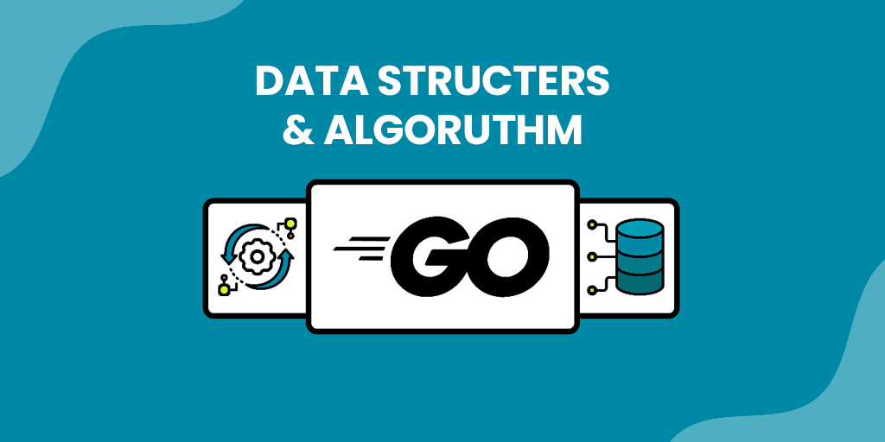

  

This is an educational repository based on the course "Data Structures & Algorithms In Go". The repository includes
practical implementations of various data structures and algorithms using the Go programming language. Each section
contains detailed guides, hands-on coding exercises, and thorough explanations of the principles at hand.

## Table of Contents

- [Arrays](#arrays)
- [Recursive Functions](#recursive-functions)
- Approaches to Solve Algorithm Design Problems
- Data Structures in Go
- Sorting
- [Stack](#stack-operations)
- Queue
- Tree
- Binary Search Tree

## Arrays

| Task                                  | Description                                                                                                                        | Complexity | How to Run                                                               |
|---------------------------------------|------------------------------------------------------------------------------------------------------------------------------------|------------|--------------------------------------------------------------------------|
| Sum Array                             | Sums all elements in an array.                                                                                                     | O(n)       | `cd 01-arrays/01-sum-array`   `go run main.go`                        |
| Sequential Search                     | Performs a linear search on an array.                                                                                              | O(n)       | `cd 01-arrays/02-sequential search`   `go run main.go`                |
| Binary Search                         | Performs a binary search on a sorted array.                                                                                        | O(log n)   | `cd 01-arrays/03-binary-search`   `go run main.go`                    |
| Max Subarray Sum (Kadane's Algorithm) | Finds the maximum sum of a subarray.                                                                                               | O(n)       | `cd 01-arrays/04-max-subarray-sum`   `go run main.go`                 |
| Array Rotation (Reversal method)      | Rotates an array by k positions.                                                                                                   | O(n)       | `cd 01-arrays/05-rotate-an-array`   `go run main.go`                  |
| Wave Array                            | Converts an array into a wave-like pattern.                                                                                        | O(n)       | `cd 01-arrays/06-wave-array`   `go run main.go`                       |
| Index Array                           | Reorders an array such that the value at each index matches its corresponding index.                                               | O(n)       | `cd 01-arrays/07-index-array`   `go run main.go`                      |
| Sorting Array (Cycle method)          | Sorts an array containing numbers from 1 to n in ascending order.                                                                  | O(n²)      | `cd 01-arrays/08-sorting-from-1-to-n`   `go run main.go`              |
| Smallest Positive Missing Number      | Finds the smallest positive missing number in an array.                                                                            | O(n)       | `cd 01-arrays/09-smallest-positive-missing-number`   `go run main.go` |
| Maximum Minimum Array                 | Reorders an array such that maximum and minimum elements alternate.                                                                | O(n)       | `cd 01-arrays/10-maximum-minimum-array`   `go run main.go`            |
| Array Index Maximum Difference        | Finds the maximum difference between indices where the element at the higher index is greater than the element at the lower index. | O(n)       | `cd 01-arrays/11-array-index-maximum-difference`   `go run main.go`   |

## Recursive Functions

| Task                           | Description                                                              | Complexity       | How to Run                                                                     |
|--------------------------------|--------------------------------------------------------------------------|------------------|--------------------------------------------------------------------------------|
| Convert Decimal to Hexadecimal | Recursively converts and prints a decimal integer in hexadecimal format. | O(log n)         | `cd 02-recursion/01-print-base-16-integers`   `go run main.go`              |
| GCD Calculation                | Recursively calculates the greatest common divisor of two integers.      | O(log min(m, n)) | `cd 02-recursion/02-greatest-common-divisor`   `go run main.go`             |
| Fibonacci Calculation          | Recursively calculates the nth Fibonacci number.                         | O(2^n)           | `cd 02-recursion/03-fibonacci-numbers`   `go run main.go`                   |
| All Permutations of a List     | Recursively generates and prints all permutations of an integer list.    | O(n!)            | `cd 02-recursion/04-all-permutations-of-an-integer-list`   `go run main.go` |
| Tower of Hanoi                 | Recursively solves the Tower of Hanoi problem for n disks.               | O(2^n)           | `cd 02-recursion/05-tower-of-hanoi`   `go run main.go`                      |
| Binary Search                  | Recursively searches for a value in a sorted array.                      | O(log n)         | `cd 02-recursion/06-binary-search`   `go run main.go`                       |

## Stack Operations

| Task                    | Description                                   | Complexity                                                                                                      | How to Run                                                           |
|-------------------------|-----------------------------------------------|-----------------------------------------------------------------------------------------------------------------|----------------------------------------------------------------------|
| Stack Using Array       | Implements a stack using Array                | Push(): O(1)   Pop(): O(1)   Top(): O(1)   IsEmpty(): O(1)   Length(): O(1)   Print(): O(n)   | `cd 03-stack/01-stack-using-array`   `go run main.go`             |
| Stack Using Linked List | Implements a stack using Linked List          | Same as above                                                                                                   | `cd 03-stack/02-stack-using-linked-list`   `go run main.go`       |
| Sorted Insert           | Inserts an element in sorted order            | O(n)                                                                                                            | `cd 03-stack/03-sorted-insert`   `go run main.go`                 |
| Sort Stack              | Sorts a stack in ascending order              | O(n^2)                                                                                                          | `cd 03-stack/04-sort-stack`   `go run main.go`                    |
| Bottom Insert           | Inserts an element at the bottom of the stack | O(n)                                                                                                            | `cd 03-stack/05-bottom-insert`   `go run main.go`                 |
| Reverse Stack           | Reverses the order of elements in a stack     | O(n²)                                                                                                           | `cd 03-stack/06-reverse-stack` `  go run main.go`                 |
| Reverse K Elements      | Reverses the first k elements in a stack      | O(n)                                                                                                            | `cd 03-stack/07-reverse-k-elements-in-a-stack`   `go run main.go` |
